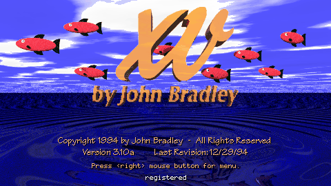

# Homebrew Taps

## Homebrew

Homebrew is a package manager for macOS. For more information about homebrew, see https://brew.sh.

## How do I install xv?

A homebrew tap for John Bradley's classic picture viewer xv.

To install it, run `brew install schaecsn/tap/xv` or `brew tap schaecsn/tap` followed by `brew install xv`.

## Homebrew Documentation

`brew help`, `man brew` or check [Homebrew's documentation](https://docs.brew.sh).
